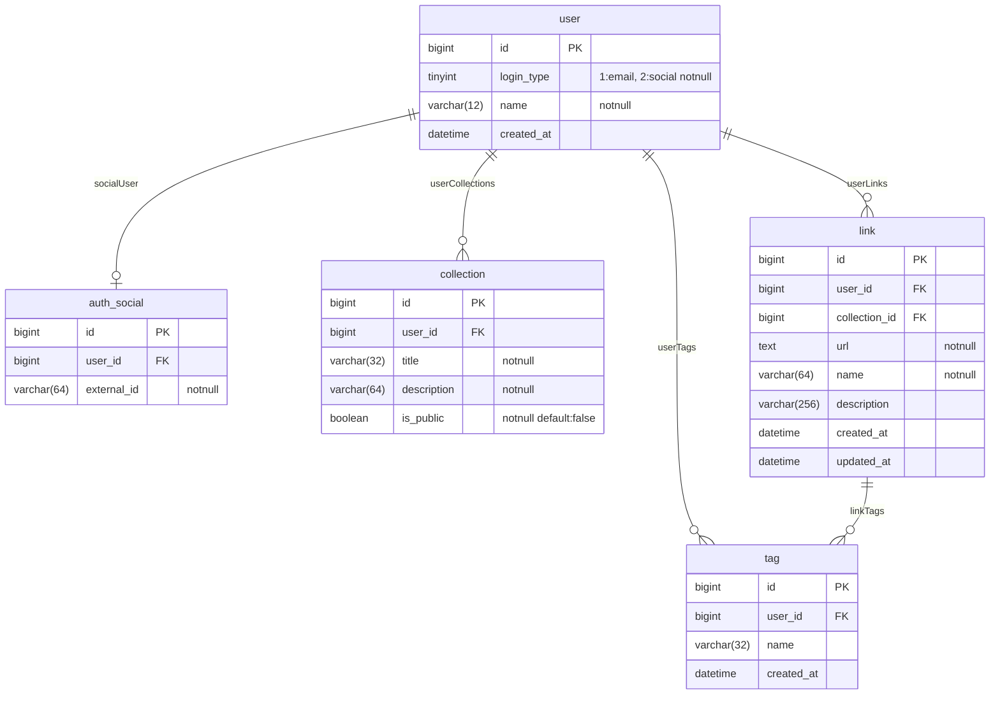

```mermaid
erDiagram

    user {
        bigint id PK
        tinyint login_type "1:email, 2:social notnull"
        varchar(12) name "notnull"
        datetime created_at
    }

    user ||--o| auth_social : socialUser
    user ||--o{ collection : userCollections

    auth_social {
        bigint id PK
        bigint user_id FK
        varchar(64) external_id "notnull"
    }

    collection {
        bigint id PK
        bigint user_id FK
        varchar(32) title "notnull"
        varchar(64) description "notnull"
        boolean is_public "notnull default:false"
    }

    user ||--o{ link : userLinks

    link {
        bigint id PK
        bigint user_id FK
        bigint collection_id FK
        text url "notnull"
        varchar(64) name "notnull"
        varchar(256) description
        datetime created_at
        datetime updated_at
    }

    user ||--o{ tag : userTags
    link ||--o{ tag : linkTags

    tag {
        bigint id PK
        bigint user_id FK
        varchar(32) name
        datetime created_at
    }
```